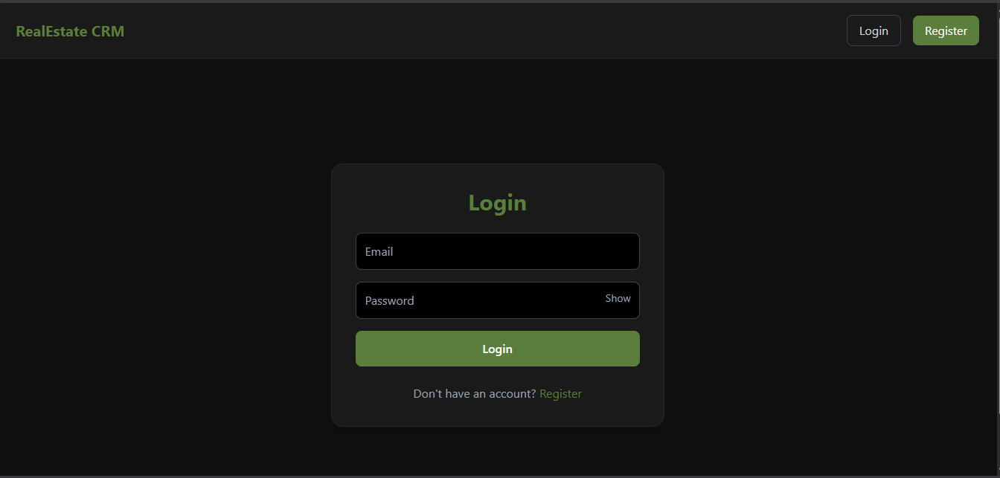
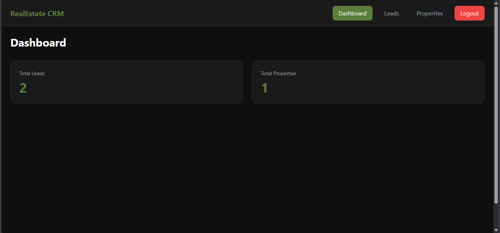
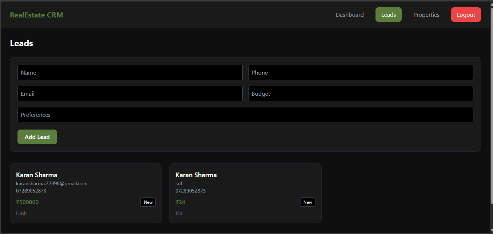
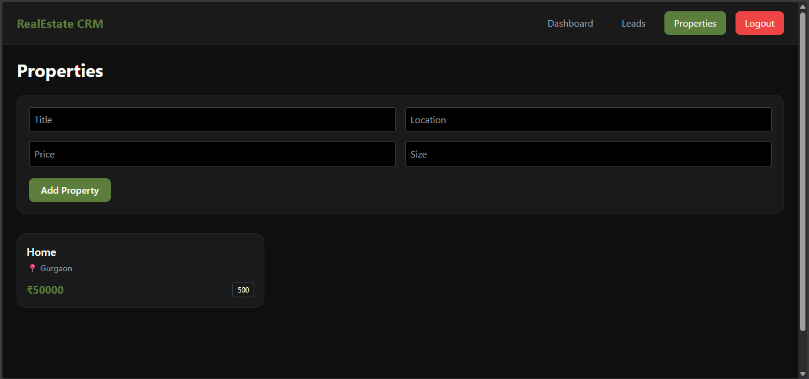

# 🏡 Real Estate CRM (Full Stack)

A full-stack **Real Estate CRM application** that allows users to manage leads and properties with secure authentication and user-specific data.

---
## 📸 Screenshot

### 🔐 Authentication (Login / Register)


---

### 📊 Dashboard


---

### 🧲 Leads Management


---

### 🏡 Properties Management


---

## 🚀 Features

* 🔐 User Authentication (Register & Login)
* 👤 User-specific data (each user sees only their data)
* 🧲 Lead Management (Add, View)
* 🏠 Property Management (Add, View)
* 📊 Dashboard with counts
* 🌑 Dark Theme UI (Black + Olive Green `#5B7E3C`)
* 🔒 Protected Routes

---

## 🛠️ Tech Stack

### Frontend

* React (Vite)
* Tailwind CSS
* Axios
* React Router

### Backend

* Node.js
* Express.js
* MongoDB (Mongoose)
* JWT Authentication

---

## 📂 Project Structure

```
project-root/
│
├── backend/
│   ├── models/
│   ├── controllers/
│   ├── routes/
│   ├── middleware/
│   └── server.js
│
├── frontend/
│   ├── src/
│   │   ├── components/
│   │   ├── pages/
│   │   └── App.jsx
│   └── index.html
│
└── README.md
```

---

## ⚙️ Setup Instructions

---

### 🔹 1. Clone Repository

```
git clone https://github.com/your-username/your-repo-name.git
cd your-repo-name
```

---

## 🔙 Backend Setup

### 📦 Install dependencies

```
cd backend
npm install
```

---

### 🔐 Create `.env` file

```
PORT=5000
MONGO_URI=your_mongodb_connection_string
JWT_SECRET=your_secret_key
```

---

### ▶️ Run backend

```
npm run dev
```

Server runs on:

```
http://localhost:5000
```

---

## 🎨 Frontend Setup

### 📦 Install dependencies

```
cd frontend
npm install
```

---

### ▶️ Run frontend

```
npm run dev
```

Frontend runs on:

```
http://localhost:5173
```

---

## 🔐 Authentication Flow

* User registers → automatically logs in
* JWT token stored in `localStorage`
* Token sent in headers:

```
Authorization: token
```

* Backend verifies token and identifies user

---

## 🧠 Multi-User Data Handling

* Each Lead & Property is linked to a user:

```
user: ObjectId
```

* Backend filters data:

```
Lead.find({ user: req.user.id })
```

👉 Ensures:

* No shared data
* Each user sees only their own data

---

## 📊 Dashboard

* Shows:
* Total Leads
* Total Properties
* Data is user-specific

---

## 🎨 UI Theme

* Background: Black (`#0f0f0f`)
* Cards: Dark (`#1a1a1a`)
* Accent: Olive Green (`#5B7E3C`)

---

## 🔒 Protected Routes

* Dashboard, Leads, Properties accessible only if logged in
* Otherwise redirected to Login page

---

## 🧪 API Endpoints

### Auth

* `POST /api/auth/register`
* `POST /api/auth/login`

### Leads

* `GET /api/leads`
* `POST /api/leads`

### Properties

* `GET /api/properties`
* `POST /api/properties`

---

## ⚠️ Note

This project is for educational purposes.
Data accuracy depends on user input and backend validation.

---

## 🚀 Future Improvements

* Edit/Delete functionality
* Search & Filters
* Image upload for properties
* Charts & analytics
* Notifications (toast)

---

## 📌 Author

**Karan Sharma**

---

## ⭐ If you like this project

Give it a star on GitHub ⭐
